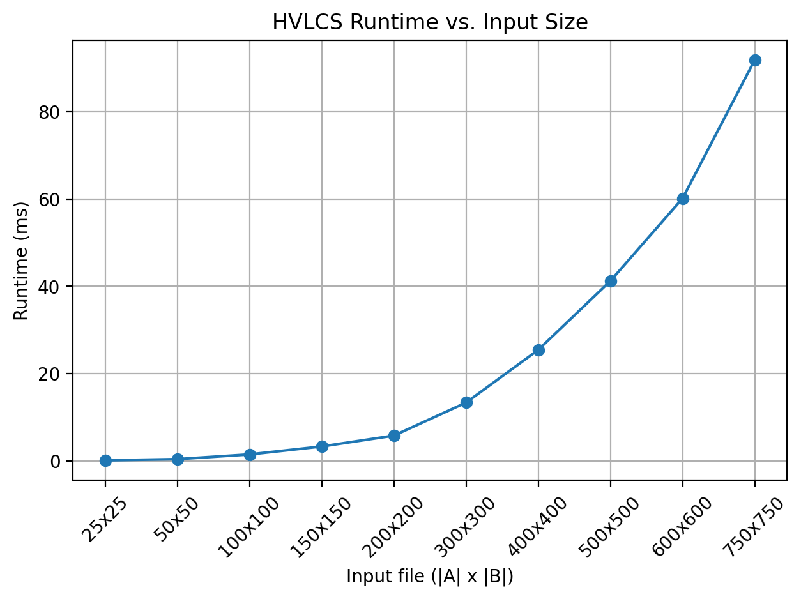

# Programming Assignment 3 - Highest Value Longest Common Subsequence

## Overview
Programming Assignment 3 computes a highest value longest common subsequence between two strings A and B, where each character in the alphabet has a nonnegative integer value. The program reads the alphabet values and the two strings from an input file, computes the maximum total value of a common subsequence, and outputs both that value and one optimal subsequence. The assignment also includes (1) an empirical runtime comparison across at least 10 nontrivial input files, (2) a recurrence equation with base cases and correctness explanation for the dynamic programming solution, and (3) pseudocode and runtime analysis for computing the HVLCS.

## Students
- Student 1: Brock Gilman - UFID: 58803474
- Student 2: Kyle Scarmack - UFID: 20823723

## Repository Structure
- `src/main.py` - Program entry point for reading input and running the HVLCS solver.
- `src/parser.py` - Input parsing logic for alphabet values and the two strings.
- `data/inputs/example.in` - Example input file.
- `data/outputs/example.out` - Expected output for `example.in`.

## Input / Output Format
### Input
Input files use:

```text
K
x1 v1
x2 v2
...
xK vK
A
B
```

- `K` = number of characters in the alphabet
- each of the next `K` lines contains a character and its assigned value
- `A` = first string
- `B` = second string

### Output
The program prints:

```text
<maximum_value>
<one_optimal_subsequence>
```

The first line is the maximum value of a common subsequence of `A` and `B`.  
The second line is one optimal subsequence that achieves that value.

## How to Run
### Requirements / Build
- Python 3.x
- No external packages required

### Example Commands
Run from the repository root:

```text
python src/main.py data/inputs/example.in
```

## Example Files
- Example input: `data/inputs/example.in`
- Expected output: `data/outputs/example.out`

Input:

```text
3
a 2
b 4
c 5
aacb
caab
```

Output:

```text
9
cb
```

## Assumptions
- The input file follows the required format.
- Character values are nonnegative integers.
- The alphabet is fixed by the `K` lines in the input.
- If multiple optimal subsequences exist, the program may output any one of them.

## How to Reproduce Outputs
Run:

```text
python src/main.py data/inputs/example.in
```

Then compare the printed result to `data/outputs/example.out`.

## Written Component
### Question 1: Empirical Comparison

#### Setup
We generated 10 nontrivial input files with string lengths ranging from 25×25 to 750×750. Each file contains randomly generated strings over a fixed alphabet with assigned character values.

For each input file, we measured the runtime of the HVLCS algorithm using time.perf_counter() as a timer. Each test was repeated three times, and the minimum runtime was recorded to reduce noise.

Below is the runtime graph:



#### Results
The runtime increases as the input size grows. Smaller inputs run very quickly, while larger inputs (e.g., 500×500 and above) take significantly longer. The graph shows a clear upward trend as both string lengths increase.


#### Brief Comment
The observed runtime growth appears approximately quadratic with respect to the input sizes, which is consistent with the expected time complexity of the dynamic programming solution, O(n · m), where n and m are the lengths of the two input strings A and B, respectively. As the lengths of the strings increase, the size of the DP table also increases, leading to higher computation time. These results confirm that the algorithm scales as expected for larger inputs.

### Question 2: Recurrence Equation

#### Claim
[add recurrence statement here]

#### Setup
[define subproblem and base cases here]

#### Proof
[explain why the recurrence is correct here]

#### Conclusion
[state why the recurrence solves the problem here]

### Question 3: Big-Oh

#### Pseudocode
[add pseudocode for computing the HVLCS here]

#### Runtime
[add runtime analysis here]

#### Conclusion
[state the final runtime here]
